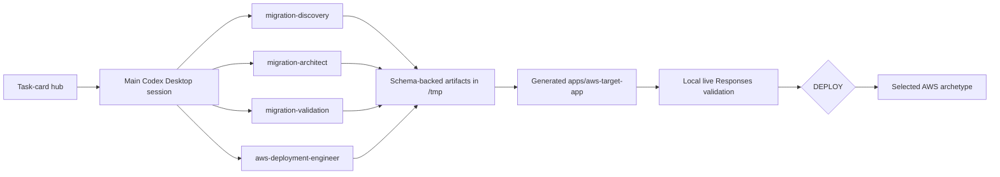

# Workshop Architecture

The hub orchestrates an evidence-driven migration rather than prescribing one AWS stack.

Supported compute archetypes are `static-web`, `serverless-http`, `public-web-container`, `private-container-service`, `event-worker`, and `kubernetes`. Data, integration, networking, secrets, observability, and AgentCore resources are conditional on evidence.

Model selection is limited to an available, Responses-compatible `openai.gpt-5.4` or `openai.gpt-5.5` tuple. Both model cards identify the special `openai/v1/responses` path. The decision stores the complete inference URL and keeps it separate from model discovery at `/v1/models`.

Grounding:

- https://docs.aws.amazon.com/bedrock/latest/userguide/bedrock-mantle.html
- https://docs.aws.amazon.com/bedrock/latest/userguide/model-card-openai-gpt-54.html
- https://docs.aws.amazon.com/bedrock/latest/userguide/model-card-openai-gpt-55.html
- https://docs.aws.amazon.com/bedrock/latest/userguide/models-api-compatibility.html
- https://docs.aws.amazon.com/bedrock/latest/userguide/models-get-info.html
